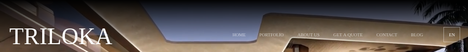
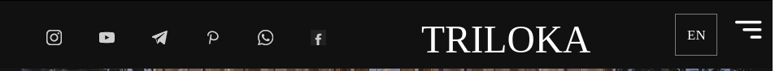
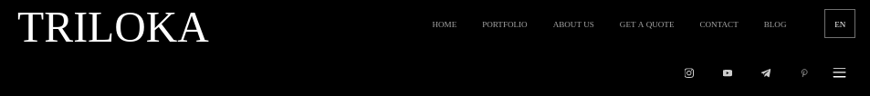
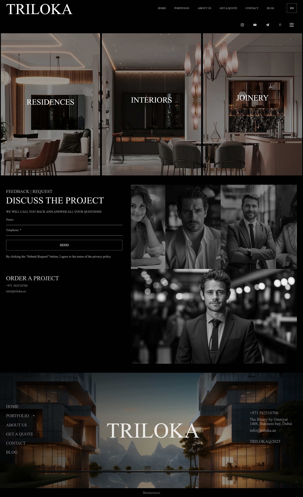
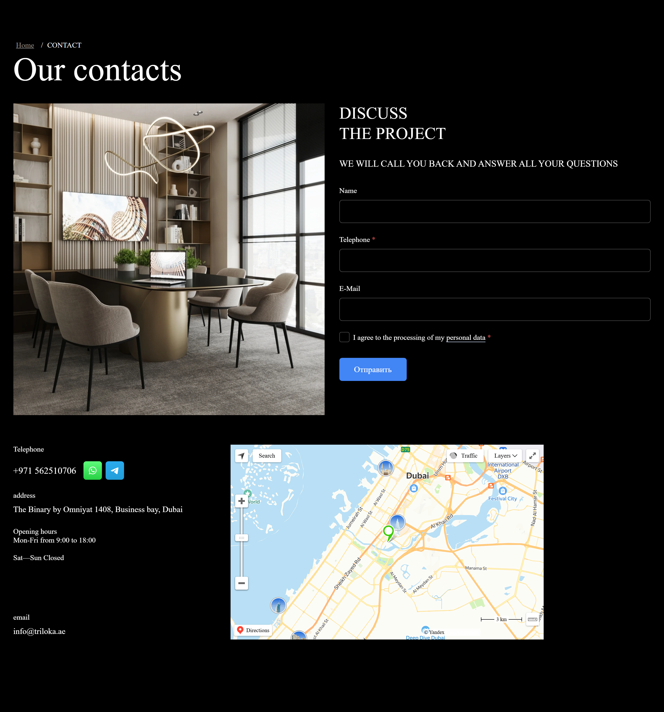

# Аудит сайта TRILOKA

**Дата:** 3 мая 2026  
**Студия:** Autocubes  
**Объект:** [https://triloka.ae/](https://triloka.ae/)  
**Платформа:** конструктор сайтов MegaGroup (megagroup.ru)

---

## Резюме

На сайте пятнадцать проблем разного уровня. Часть структурная: шапка не стандартизована и ведёт себя на каждой странице по-своему, `/portfolio` превращена в страницу-меню без собственной ценности. Часть — критические кодовые баги: например, страница контактов носит в `<title>` имя другой компании.

---

# Часть 1. Структурные и визуальные проблемы

## 1. Шапка — три разных компонента на трёх страницах

Шапка — единственный элемент, который пользователь видит на каждой странице, и за консистентность бренда отвечает в первую очередь именно она. На triloka.ae формально это «одна шапка», но на главной, в портфолио и на контактах живут фактически три разные её копии. Они расходятся по составу элементов, по позиционированию, по поведению при скролле и по адаптивному режиму. Ниже — что именно отличается.

### Состав элементов на каждой странице (десктоп)

| Параметр | Главная | Портфолио | Контакты |
|---|---|---|---|
| Логотип | есть | есть | есть |
| Навигационные ссылки | есть | есть | есть |
| Раскладка десктопа | 1 ряд | **2 ряда** (логотип+меню сверху, соцсети+бургер снизу) | 1 ряд |
| Иконки соцсетей (десктоп) | Instagram, YouTube, Telegram, WhatsApp, Facebook (но прозрачные после анимации, см. ниже) | Instagram, YouTube, Telegram, Pinterest | **нет** |
| Бургер на десктопе | нет | **есть** (дублирует горизонтальное меню) | нет |

Шапка главной — десктоп:


Шапка главной — адаптив:


Шапка /portfolio — десктоп:


Шапка /portfolio — адаптив:


Шапка /contacts — десктоп:


Шапка /contacts — адаптив:


### Поведение при скролле — у каждой страницы своё

| Страница | Десктоп | Мобилка |
|---|---|---|
| Главная | **не fixed**: уезжает с контентом. При скролле снизу вверх возвращается с fade-in анимацией; иконки соцсетей в этой анимации остаются прозрачными (физически на странице есть, визуально не видны) | **fixed**: всегда виден, но на узких экранах элементы (соцсети, логотип) наезжают друг на друга |
| Портфолио | **fixed**: всегда виден. Почти нет затемнения/фона → при скролле по светлым фотографиям шапка сливается с контентом, меню становится нечитаемым | **fixed**: те же проблемы со фоном, что и на десктопе |
| Контакты | **не fixed**: уезжает с контентом. Но при скролле по странице сверху проявляется фрагмент **бургер-иконки от мобильной версии шапки** — он виден, «летает» сверху и иногда выпирает за край (см. ниже) | **fixed**: всегда виден |

Три страницы, три разных режима позиционирования. Компонента шапки как сущности здесь по сути нет: каждая страница хранит свою копию настроек, которые ни с чем не синхронизированы.

### Утечка элементов из адаптивной шапки в десктопную (`/contacts`)

На `/contacts` десктопная шапка обычная: не fixed, не sticky, едет с контентом при скролле. Но сверху на странице всё равно проявляется бургер-иконка из мобильной версии — обрезок бургер-меню висит поверх контента и временами заметно торчит за край. На широких экранах должны рендериться только элементы десктопной шапки, а адаптивная иконка не выгружается и при определённых положениях скролла попадает в кадр.

### Что не так системно

Главное системное наблюдение — нет единого источника правды. Конструктор разрешает редактировать шапку поблочно на каждой странице, и кто-то когда-то пересобрал шапку портфолио: развёл в две строки, поставил бургер, поменял состав соцсетей, добавил CTA в адаптив. На контактах решили иначе и убрали соцсети совсем. На главной осталась историческая версия с прозрачными иконками. Так и устаканилось: вместо одной шапки три копии, живущие отдельно.

Из-за этого расходятся буквально все базовые элементы. Соцсети: пять иконок на главной, четыре на портфолио (с Pinterest вместо WhatsApp и Facebook), ноль на контактах. В футере соцсетей нет нигде, ни на одной странице. Пользователь, доскроллив до низа, не имеет ни одного пути в Instagram или Telegram студии — а это базовая точка перехода для архитектурного бренда. Каналы у студии либо есть, либо нет; их набор не должен зависеть от того, на какую страницу пользователь зашёл.

Несколько проблем сидят на конкретных страницах. На главной иконки соцсетей после fade-in анимации шапки остаются с прозрачностью ниже видимого порога: технически они на странице есть, по ним даже можно случайно кликнуть, визуально их не существует. Это хуже, чем если бы их просто не было. Шапка `/portfolio` закреплена поверх страницы без подложки — на любой светлой фотографии меню становится нечитаемым; ни непрозрачный фон, ни лёгкое размытие не применены. На той же странице рядом с горизонтальным меню стоит бургер-иконка `≡`, хотя бургер — это паттерн узких экранов, и горизонтальное меню делает его избыточным.

Контраст и читаемость на десктопе тоже не доведены. Прозрачная шапка лежит поверх hero-видео в тёмной палитре; на светлых кадрах (камера смотрит вверх в потолок интерьера) ссылки сливаются с фоном, а scrolled state с непрозрачной подложкой при скролле не реализован. Шрифт меню на 1920px-мониторе на грани читаемости: premium-сайты архитектурного уровня делают навигацию крупнее и с заметными отступами, здесь же размер скорее портальный.

Адаптив добавляет своего. На промежуточных ширинах элементы шапки наезжают друг на друга; на некоторых мобильных разрешениях иконки соцсетей залезают на логотип.

Корень всего — сама платформа. Шапки как переиспользуемого компонента в конструкторе не существует; каждая страница хранит свою копию, и параллельно с этим живут две отдельные шапки (десктоп и мобилка) внутри одной страницы. Синхронизировать их можно только вручную и только до тех пор, пока никто случайно не пересоберёт ещё раз.

## 2. `/portfolio` — каталог из трёх ссылок

На странице [/portfolio](https://triloka.ae/portfolio) — три плитки-категории: RESIDENCES, INTERIORS, JOINERY. Каждая ведёт на отдельную подстраницу со своими проектами. Никакого предпросмотра, обзора, смешанного фида или фильтра, только три ссылки.



При этом на сайте есть и четвёртая категория — «Office design and commercial finishing in Dubai», которая упоминается в шапке и в портфолио-превью на главной. На самой `/portfolio` ссылки на неё не существует, попасть туда можно только через выпадающее меню в шапке.

Страница `/portfolio` должна быть точкой входа в портфолио: с быстрым визуальным обзором всех категорий, с избранными проектами в смешанном фиде, с фильтром по типу/году/локации. Сейчас это страница-меню. Меню уже есть в шапке — отдельная страница, которая делает ровно то же самое, не несёт собственной ценности и сжигает один лишний клик.

Само разделение проектов на категории логично: у клиента, который ищет интерьер квартиры, и у клиента, который ищет commercial fit-out, разный запрос. Но архитектура «hub + категории» работает только тогда, когда hub несёт самостоятельную ценность; здесь он её не несёт.

## 3. Блок «PANORAMA / 360» не функционирует

На главной секция 8 озаглавлена «PANORAMA | 360 / PANORAMA», но содержит просто статичную фотографию интерьера. 360°-вьюера, вращающейся панорамы или хоть какого-то взаимодействия там нет.


Заголовок прямо обещает 360°. Пользователь, который наводит курсор на картинку в ожидании вращения или кнопки «Открыть панораму», не получает ничего. Дальше есть два варианта: либо реализовать вьюер через любую стандартную библиотеку 360°-просмотра, либо убрать упоминание 360° из названия секции.

На мобильной вёрстке надпись «Панорама» вылезает перед блоком «DISCUSS THE PROJECT» и визуально приклеивается к нему вместе с фотографиями людей из соседнего блока — то есть сначала идёт название следующей секции, потом сама предыдущая. Это последствие того, что при переключении на мобильную раскладку конструктор теряет контроль над порядком элементов в колонках. Типичная история для шаблонных билдеров, которые не различают логический DOM-порядок и визуальный порядок на экране.

## 4. На главной нет CTA-кнопки

Первый экран главной — hero-видео и название студии, дальше можно только скроллить. Кнопки действия нет: ни «Discuss the project», ни «View portfolio», ни «Get a quote». Пользователь, попавший на сайт, не получает понятного следующего шага. Базовый паттерн в индустрии — один заметный CTA на первом экране, ведущий либо к форме внизу страницы (плавный скролл к блоку «DISCUSS THE PROJECT»), либо в портфолио.

## 5. Нет якорной навигации на главной

Главная — длинная скроллящаяся страница с десятком блоков (hero, intro, портфолио-превью, панорама, форма, footer), но ни одной якорной ссылки на эти блоки нет. Когда пользователь приходит с конкретной задачей — «увидеть, как они делают коммерческие интерьеры» или «дойти до формы обратной связи», — у него два варианта: скроллить весь длинный документ вручную или уйти на внешние страницы через основное меню и потом, может быть, вернуться. Решение тривиальное: пункты меню должны вести напрямую к нужной секции; контент при этом не трогается вообще.

## 6. Кнопки «Learn more» ведут непредсказуемо

В портфолио-превью на главной — четыре блока с кнопкой «Learn more», и поведение у этих кнопок разное.


Часть из них открывает модальное окно «Book a consultation now!», часть переводит на отдельные страницы каталога. Какая ведёт куда — визуально не отличить, поэтому пользователь каждый раз кликает наугад.

С самим модальным окном отдельная история. Появляется оно поверх главной страницы, на которой ниже по скроллу уже стоит полноценный блок «DISCUSS THE PROJECT» с той же формой — то есть один и тот же CTA дублируется на одной странице. Закрывается модал без анимации, мгновенным исчезновением, что выбивает пользователя из визуального потока. И, наконец, само поведение нарушает семантику кнопки: «Learn more» по смыслу — это «расскажи больше про проект», а не «открой форму записи». Если рассказывать нечего на отдельной странице, кнопка должна плавно прокручивать к блоку формы, а не выкидывать модал.

## 7. Переключение языка сбрасывает на главную

Переключатель языка `EN ⇄ RU` на любой странице, кроме главной, ведёт пользователя на главную в выбранной языковой версии — а не на эквивалент текущей страницы. На практике это сценарий потери клиента: иностранный заказчик читает страницу проекта в портфолио (`/portfolio/architecture`), хочет посмотреть её же на родном языке, кликает переключатель и оказывается на главной. Чтобы вернуться к проекту, ему нужно снова пройти всю навигацию. Шансов, что он повторит этот путь, меньше, чем шансов, что закроет вкладку.

Корректное поведение здесь предельно простое: переключатель меняет только язык, страница остаётся та же. Со страницы проекта в портфолио — на ту же страницу проекта в другом языке.

## 8. Региональные сервисы на международном сайте

TRILOKA — студия в Дубае, ориентированная на международную (включая западную) аудиторию. При этом на сайте параллельно работают три региональных российских сервиса.

На странице контактов стоит Яндекс.Карта — сервис, основной охват которого СНГ; в ОАЭ его доля близка к нулю, в Европе и США он практически отсутствует. У клиента из Дубая, Лондона или Дюссельдорфа карта в зависимости от условий может загрузиться с задержкой, без спутниковой подложки, не загрузиться вовсе или открыться с интерфейсом на русском. Google Maps — единственный универсально-понимаемый картографический сервис; для UAE-студии с международным позиционированием выбор Яндекса логически не объясняется и скорее всего наследие шаблона (см. ниже про `<title>` ONZE).

Аналитика — Яндекс.Метрика. Это значит: данные не интегрируются с Google Ads, Display & Video 360 и любым международным маркетинговым стеком; отчётность для иностранных партнёров приходится показывать на платформе, которой они не пользуются; сегментация работает хорошо для СНГ-трафика и заметно хуже для европейского и ближневосточного. Минимальная и бесплатная замена — Google Analytics 4.

Поверх этого на каждой странице висят счётчики самой MegaGroup и движок конструктора. Каждое посещение сайта генерирует трафик к серверам MegaGroup и Яндекса; в терминах GDPR и cookie consent это требует обязательного упоминания этих сервисов в политике приватности (которой на сайте, насколько видно, нет). Само по себе это не баг, а естественное условие платформы — но для иностранной аудитории это дополнительный сигнал «российская инфраструктура».

## 9. Прелоадер на каждом переходе между страницами

Анимация загрузки воспроизводится при каждом клике по навигации. Открыли главную — прелоадер, кликнули по «Portfolio» — снова прелоадер, перешли на «Contact» — опять. Оправдан он, между тем, ровно в одном сценарии: при самой первой загрузке сайта, пока подтягиваются критические ресурсы — шрифты, hero-видео, ключевые изображения. На внутренних переходах прелоадер лишний, всё это браузер уже скачал.

Принудительная задержка на каждом клике работает против премиального позиционирования: вместо ощущения «утончённый и продуманный» получается «медленный, тормозит». Для архитектурного бюро такого уровня это особенно дорогая ассоциация. Чинится в одну правку: прелоадер только на первой загрузке, внутри сайта переходы мгновенные.

---

## 10. Самопроизвольная анимация изображений по таймеру

Через несколько секунд после загрузки страницы изображения сами начинают увеличиваться до полной ширины и высоты. Анимация идёт около тридцати секунд, страница за это время заметно вытягивается. Никакого действия пользователя для этого не нужно, просто срабатывает внутренний таймер.

Здесь ломается базовое правило интерфейса: анимация должна быть откликом на действие. Скролл вызывает параллакс, курсор вызывает hover, бездействие не должно вызывать ничего. Когда экран начинает двигаться сам, ассоциация у пользователя уходит не к дизайну, а к багу или к агрессивной рекламе. Архитектурный бренд продаёт ощущение контроля; самопроизвольные движения это ощущение прямо подрывают. Плюс есть performance-cost: скрипт всё время просмотра держит активный таймер и заставляет браузер перерисовывать содержимое — нагрузка ради эффекта, который не приносит пользы.

## 11. Общий визуальный рассинхрон

По всему сайту разбросаны мелкие визуальные несостыковки: на разных страницах размеры одного и того же типа текста немного отличаются, скругления у блоков ведут себя непоследовательно, элементы не всегда выровнены друг относительно друга. На страницах отдельных проектов — например, [«Современная вилла на острове Аль-Марджан»](https://triloka.ae/sovremennaya-villa-na-ostrove-al-mardzhan-v-ras-el-hajme) — галерея представляет собой просто столбик фотографий разного размера и формата; каждая картинка обрезана по-своему, никакой единой сетки или carousel-логики не предусмотрено.

Точечно такие вещи в рамках текущего шаблона не лечатся, их можно убрать только переписыванием.

---

# Часть 2. Кодовые проблемы

## 12. CAPS-LOCK вбит в HTML, а не задан стилями

Заголовки и многие подписи на сайте набраны заглавными буквами прямо в исходнике: `<h1>20 YEARS OF EXPERIENCE…</h1>` вместо `<h1>20 years of experience…</h1>` со стилем `text-transform: uppercase`. На экране результат тот же, но в коде это совершенно другой подход, и он несёт сразу несколько проблем.

Главное — нарушено разделение контента и презентации. Внешний вид (регистр, цвет, размер) — задача CSS. Сегодня дизайнер хочет ALL CAPS, завтра — Title Case: в первом случае это правка одной строки в стилях на весь сайт, во втором придётся вручную переписать каждый заголовок на каждой странице. Параллельно страдает SEO: поисковики токенизируют текст, и «ДИЗАЙН» с «дизайн» для них формально разные строки — капс в HTML смещает вес ключевых слов и затрудняет нормализацию. Есть и accessibility-эффект: скринридеры некоторых поколений интерпретируют ALL CAPS как команду «читать побуквенно», особенно на коротких словах; «JOINERY» в худшем случае произносится как «Дж-О-Й-Н-Е-Р-И». В качестве вишенки — в админке контент-менеджер видит «20 YEARS OF EXPERIENCE» и легко делает опечатку, путая регистр при правке.

Поверх всего этого ещё и непоследовательность: на странице контактов основной заголовок «Our contacts» набран в Title Case. То есть и капс-в-HTML, и капс-через-CSS, и обычный регистр сосуществуют на одном сайте без какой-либо системы.

## 13. Страница контактов носит имя другой компании

Живой `<title>` страницы [/contacts](https://triloka.ae/contacts) — `«Контакты ONZE,»`. Текст на русском, бренд чужой.

Это моментально бьёт по двум каналам. Поисковые системы используют `<title>` как основной идентификатор страницы — прямо сейчас в индексе Google и Яндекса страница контактов TRILOKA числится под именем «Контакты ONZE,». Пользователь, увидевший такой сниппет в выдаче («Контакты ONZE» вместо «Контакты TRILOKA»), не кликнет: он просто не опознает бренд. Тот же `<title>` подтягивается в превью при отправке ссылки в WhatsApp, Telegram или LinkedIn, и получатель тоже видит чужое название и не понимает, что это вообще.

На той же странице от шаблона ONZE остались и другие следы:

| Элемент | Текущее значение | Должно быть |
|---|---|---|
| Текст кнопки отправки | «Отправить» (русский) | Send / Submit |
| Цвет кнопки | `#007bff` (ярко-синий, off-brand) | в фирменной палитре сайта (тёмный/контрастный) |
| Набор полей формы | Name + Telephone + E-Mail + чекбокс согласия | согласован с формами на главной и портфолио (там Name + Telephone, без согласия) |



## 14. Дубли DOM-блоков и 404 на шрифтах

### Дубли DOM

Конструктор рендерит несколько блоков на странице дважды — два разных DOM-узла с одинаковым содержимым и одинаковыми координатами на экране. На главной и портфолио задвоен футер; на контактах задвоена вся центральная зона (форма + контакты + карта, 1542px по высоте), плюс ещё один экземпляр футера, схлопнутый до нулевой высоты.

На что это влияет: браузер строит layout для каждого узла отдельно (лишний рендер и время); если на дубль навешан клик-обработчик, он может выполниться дважды; скринридер прочитает контент дважды, а поисковик увидит повтор внутри страницы — минус для SEO; в DevTools на каждой странице висит куча ошибок от мёртвых стилей и дублирующихся обработчиков, и любая дальнейшая работа с сайтом за счёт этого усложняется.

### Шрифт Onest: девять файлов 404

CSS подключает Onest в двух форматах — современном `.woff2` и резервном `.woff`. Все девять `.woff`-вариантов (от thin 100 до black 900) отдают `HTTP 404 Not Found`:

```
https://triloka.ae/g/fonts/onest/onest-t.woff     — HTTP 404
https://triloka.ae/g/fonts/onest/onest-e-l.woff   — HTTP 404
https://triloka.ae/g/fonts/onest/onest-l.woff     — HTTP 404
https://triloka.ae/g/fonts/onest/onest-r.woff     — HTTP 404
https://triloka.ae/g/fonts/onest/onest-m.woff     — HTTP 404
https://triloka.ae/g/fonts/onest/onest-s-b.woff   — HTTP 404
https://triloka.ae/g/fonts/onest/onest-b.woff     — HTTP 404
https://triloka.ae/g/fonts/onest/onest-e-b.woff   — HTTP 404
https://triloka.ae/g/fonts/onest/onest-bl.woff    — HTTP 404
```

`.woff2` отдаются нормально, поэтому пользователь проблему не замечает. Но в DevTools на каждой странице пишется девять failed requests, и для разработчика, которому в будущем придётся подхватить сайт, это сразу читается как «здесь что-то заброшено». Заодно 404 даёт иконочный шрифт LightGallery (`lg.woff`, `lg.ttf`) — управляющие иконки в лайтбоксе галереи (стрелки, крестик, zoom) могут отображаться как пустые квадраты.

## 15. Главная — одна гигантская секция-обёртка 6386px

DOM-инспекция показала любопытное. Главная страница состоит из двенадцати `.section`-блоков, но один из них — `#irz7t50pd_0` — имеет высоту **6386 пикселей**. Весь контент ниже hero — от вступительного текста до подвала — физически лежит внутри этого одного DOM-узла.

Это не ошибка отображения. Так структуру построил сам конструктор: вместо того, чтобы каждую смысловую секцию (intro, портфолио-превью, панорама, форма) сделать отдельной семантической единицей, всё упаковано в одну гигантскую обёртку с вложенными блоками.

Прикладных проблем из этого несколько. «Секцию формы» нельзя адресовать как отдельную единицу — на верхнем уровне DOM её просто нет. Якорные ссылки тоже некуда прицеплять: у смысловых блоков нет своих контейнеров с понятными ID. И скринридеры с поисковиками не получают семантической карты страницы — они видят один большой кусок без структуры.

В чистой разметке всё это разбилось бы на пять-шесть `<section>` с понятными классами (`.intro`, `.services-preview`, `.panorama`, `.contact-form`). В текущем виде на их месте — один тег с шестикилометровым содержимым.

---

# Что можно попытаться починить на текущей платформе

Часть точечных проблем, в принципе, можно попробовать починить прямо в текущем конструкторе — это правки в админке по одной на каждое место. Например: заголовок страницы контактов («Контакты ONZE» → «Контакты TRILOKA»), русская кнопка «Отправить» в форме, разнонаправленные кнопки «Learn more». Возможно, получится поменять Яндекс-карту на Google Maps и Яндекс.Метрику на Google Analytics, если соответствующие виджеты в конструкторе вообще доступны.

Но и тут нет гарантий. Конструктор — закрытая среда: одно правится через интерфейс, другое прибито к шаблону, и доступа к нему нет. Может оказаться, что Google Analytics 4 на этой платформе не интегрируется; что 360°-вьюер не встраивается ни одним из доступных виджетов; что капс задаётся стилем не везде, а только в части блоков. Всё это надо проверять руками — и если упрётся в платформу, решений в её рамках уже не появится.

Главное в другом: **системно и до конца исправить всё на текущей платформе невозможно.** Сделать шапку единым компонентом нельзя, потому что её там и нет — у каждой страницы своя копия, и при любом изменении придётся вручную синхронизировать три варианта. DOM-дубли, 404 на шрифтах, прелоадер на каждом клике, гигантская секция-обёртка на главной, переключатель языка, сбрасывающий на главную — это всё побочные эффекты самой платформы, и повлиять на них в её рамках нельзя. Убрать со страниц скрипты MegaGroup означает уйти с MegaGroup.

На длинной дистанции каждое исправление в рамках конструктора — это борьба с инструментом: обходные пути через виджеты, ручная синхронизация одного и того же блока на трёх страницах, или просто тупик. Суммарно это тратит больше времени, чем переписать сайт на собственный код с нуля.

---

# Рекомендация

Перенести сайт на собственный код. Это закрывает все пункты аудита.

---
