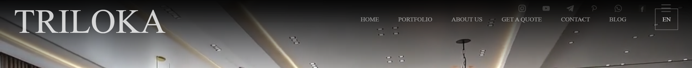
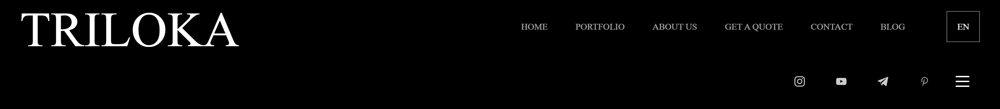
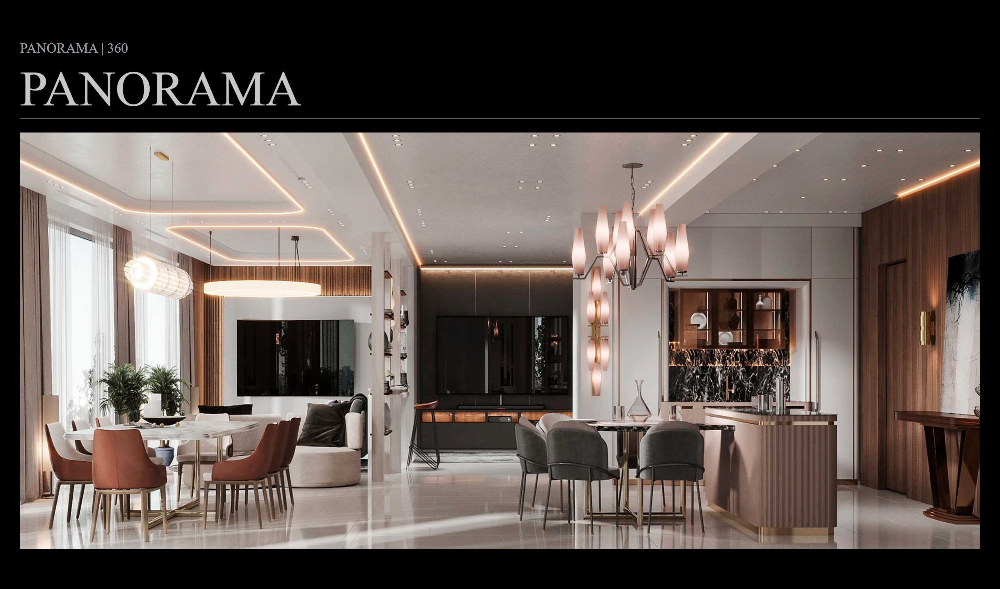
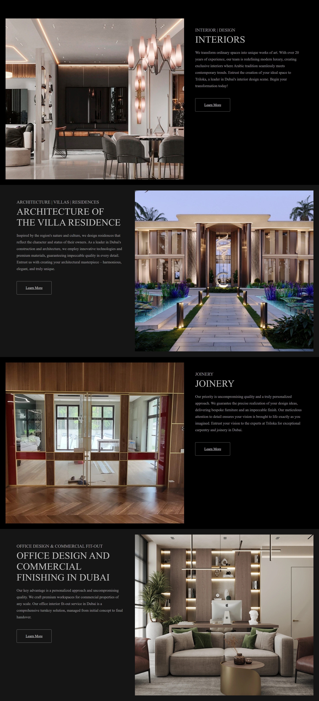

# Аудит сайта TRILOKA — triloka.ae

**Дата:** 13 апреля 2026  
**Студия:** Autocubes
**Объект:** [https://triloka.ae/](https://triloka.ae/) — главная, [/portfolio](https://triloka.ae/portfolio), [/contacts](https://triloka.ae/contacts)  
**Платформа:** конструктор сайтов MegaGroup (megagroup.ru)

---

## Резюме

На сайте найдено более двадцати разноуровневых проблем — от структурных провалов (шапка не стандартизована и ведёт себя на каждой странице по-своему, `/portfolio` превращена в страницу-меню без собственной ценности) до критических кодовых багов (контактная страница носит имя чужой компании в `<title>`).

Аудит организован по типу проблем: сначала **структурные** (как устроена навигация и страницы), затем **визуальные** (как это выглядит), затем **кодовые** (что лежит под капотом). Часть из них чинится точечно, даже без миграции с конструктора. Часть — фундаментальные, и решаются только переходом на собственный код. В разделе «Что чинится отдельно, а что — нет» мы это разводим.

---

## Метод

Аудит совмещает два подхода:

1. **Визуальный обход** — клик-через-клик по сайту на десктопе, планшете и мобиле, проверка поведения шапки, формы, навигации, ссылок.
2. **Структурный анализ** — выгрузка реальной DOM-структуры, скриншоты на пяти разрешениях каждой страницы, изоляция шапки, hero, всех секций и подвала, инвентаризация шрифтов и изображений.

---

# Часть 1. Структурные проблемы

## 1. Шапка не стандартизована

Шапка — единственный элемент, который пользователь видит на каждой странице. На triloka.ae это технически один и тот же DOM-элемент (`#intw37gfc_0`), но визуально и поведенчески — три разных компонента.

**Сводная таблица (из реальных DOM-измерений):**

| Параметр | Главная | Портфолио | Контакты |
|---|---|---|---|
| Высота | 157px | **177px** | **133px** |
| Фон | прозрачный поверх hero | сплошной чёрный | сплошной чёрный |
| Логотип | есть, средний | есть, **в ~3 раза крупнее** | **нет** |
| Навигационные ссылки | есть, мелкие | есть, более крупные | **нет** |
| Иконки соцсетей (десктоп) | Instagram, YouTube, Telegram, WhatsApp, Facebook | Instagram, YouTube, Telegram, Pinterest | **нет** |
| Бургер на десктопе | нет | **есть** | есть (единственный элемент) |
| Раскладка | 1 ряд | **2 ряда** | 1 ряд (пустой) |

**Главная** — прозрачная шапка поверх hero-видео, средний логотип, мелкое горизонтальное меню, пять иконок соцсетей:



**Портфолио** — сплошной чёрный фон, логотип в три раза крупнее, две строки, бургер на десктопе:



**Контакты** — пустой чёрный бар. Ни логотипа, ни меню, ни соцсетей. Пользователь, попавший на `/contacts` напрямую (по ссылке из мессенджера или поиска), не видит ни бренда, ни возможности перейти на главную:


**Что не так системно:**

- **Не стандартизована.** Конструктор позволяет редактировать шапку поблочно на каждой странице независимо — без единого источника правды. Кто-то когда-то пересобрал шапку портфолио (увеличил логотип, развёл в две строки), забыл сделать то же на контактах (там вообще выпали логотип и меню), и так уже устаканилось.
- **Не sticky.** При скролле шапка уезжает за верх экрана и не возвращается. На длинных страницах (главная — 7000+ пикселей по высоте) пользователь, дочитавший до низа, чтобы перейти куда-то ещё, обязан сначала промотать обратно вверх. Шапка должна быть прикреплена к экрану, чтобы доступ к навигации сохранялся в любой точке скролла.
- **Адаптив срабатывает не вовремя.** На некоторых разрешениях шапка раньше времени схлопывается в бургер-меню. При этом внутри бургера ничего, кроме самого бургера, нет — пользователь открывает меню и видит пустоту. На промежуточных шириных (1100–1280px) элементы внутри шапки наезжают друг на друга. На планшете «HOME» уезжает вверх, «GET A QUOTE» растягивается на две строки. На некоторых мобилах иконки соцсетей залезают на логотип — типичный признак фиксированных значений вместо flex/grid.
- **В адаптивном режиме нет логотипа.** Когда шапка переключается в узкий/мобильный вариант, минимум, что должно остаться — это логотип, чтобы кликом возвращаться на главную. На текущей шапке `/contacts` логотипа нет ни в каком состоянии — это значит, что пользователь физически не может определить, на каком сайте находится.
- **Бургер на десктопе.** На странице портфолио на полноразмерном экране кроме горизонтального меню справа ещё и бургер-иконка `≡`. Десктоп получает обычное меню, бургер — паттерн только для узких экранов; здесь они дублируются.
- **Соцсети разные везде.** На главной — пять иконок, на портфолио — четыре (с Pinterest, без WhatsApp/Facebook), на контактах — ноль. В **подвале соцсетей нет нигде** — пользователь, доскроллил до низа, не имеет ни одного пути в Instagram или Telegram студии. То есть в шапке соцсети есть, но разные; в футере их нет вовсе.
- **Низкий контраст на главной.** Прозрачная шапка поверх hero-видео тёмной палитры. На светлых кадрах (камера смотрит вверх в потолок интерьера) ссылки сливаются с фоном. Решения «scrolled state» с непрозрачным фоном при скролле или лёгкой подложки под шапкой нет.
- **Мелкие ссылки на десктопе.** Высота шрифта меню на 1920px-мониторе — на грани читаемости. Premium-сайты архитектурного уровня (David Chipperfield Architects, Foster + Partners, Studio David Thulstrup) делают навигацию крупной и с заметными отступами; здесь скорее размер сайта-портала, чем сайта студии.

Источник всего этого — сам конструктор: каждая страница хранит свою копию шапки, систематически решить нельзя, можно только догонять расхождения вручную.

## 2. `/portfolio` — каталог из трёх ссылок

**Что есть:** на странице [/portfolio](https://triloka.ae/portfolio) — три плитки-категории: RESIDENCES, INTERIORS, JOINERY. Каждая ведёт на отдельную подстраницу со своими проектами. Никакого предпросмотра, обзора, миксованного фида, фильтра. Только три ссылки.

**Доказательство:** на скриншоте видна вся страница — три плитки и больше ничего.


**Что хуже:** на самом сайте есть четвёртая категория — «Office design and commercial finishing in Dubai» (упоминается в шапке и на главной в портфолио-превью). На странице `/portfolio` ссылки на неё нет вообще. Доступ к этой странице есть только из выпадающего меню в шапке.

**Что должно быть:** страница `/portfolio` должна быть точкой входа в портфолио — с быстрым визуальным обзором всех категорий, с возможностью увидеть избранные проекты микса, с фильтром по типу/году/локации. То, что сейчас — это страница-меню. Меню уже есть в шапке, дублировать его в виде страницы — пустая трата клика.

**Оговорка:** разделение проектов на категории логично — у клиента, ищущего интерьер квартиры, и клиента, ищущего commercial fit-out, разный запрос. Но архитектура «hub + категории» работает только тогда, когда hub несёт собственную ценность. Сейчас он её не несёт.

## 3. Блок «PANORAMA / 360» не функционирует

**Что есть:** на главной странице секция 8 (`#ilqzhou7h_0`, 849px) озаглавлена «PANORAMA | 360 / PANORAMA» и содержит статичную фотографию интерьера. Никакого 360°-вьюера, никакой вращающейся панорамы, никакого взаимодействия — просто крупная фотография.

**Доказательство:** под заголовком «PANORAMA | 360 / PANORAMA» — обычная неинтерактивная фотография.



Заголовок прямо обещает 360°. Пользователь, наводящий курсор на эту картинку в ожидании drag-to-rotate или кнопки «Открыть панораму», получает ничего. Это либо нужно реализовать (Krpano, Marzipano, или встроенный iframe от Matterport), либо переименовать секцию и убрать упоминание 360°.

**Дополнительная проблема на мобиле:** надпись «Панорама» оказывается перед блоком «DISCUSS THE PROJECT» и визуально приклеивается к нему — включая фотографии людей из этого блока. То есть сначала идёт название следующего блока, потом сам предыдущий блок. Это последствие потери CSS-контроля над порядком элементов в колонках при переключении на мобильную раскладку — типичная проблема шаблонного билдера, который не различает «логический порядок DOM» и «визуальный порядок на экране».

## 4. Главная — одна гигантская секция-обёртка 6386px

DOM-инспекция показала любопытное: главная страница состоит из 12 `.section`-блоков, но один из них — `#irz7t50pd_0` — имеет высоту **6386 пикселей**. Это значит, что весь контент ниже hero (от вступительного текста до подвала включительно) физически находится внутри одного DOM-узла.

Это не ошибка отображения, это структура, которую нагенерировал конструктор: вместо того, чтобы каждую смысловую секцию (intro, портфолио-превью, панорама, форма) сделать отдельной семантической единицей, всё уложено в одну гигантскую обёртку с вложенными блоками.

**Последствия:**

- Нельзя адресовать «секцию формы» как отдельную единицу — она не существует на верхнем уровне DOM.
- Якорные ссылки сложно прицепить к смысловым блокам — у них нет своих контейнеров с осмысленными ID.
- Скринридер и поисковики не получают семантической карты страницы.

В чистой разметке это пять-шесть `<section>` с понятными классами (`.intro`, `.services-preview`, `.panorama`, `.contact-form`). В текущем виде это один тег с шестикилометровым контентом.

## 5. Нет якорной навигации на главной

**Что есть:** главная — длинная скроллящаяся страница с десятком блоков (hero, intro, портфолио-превью, панорама, форма, footer). При этом нет ни одной якорной ссылки, чтобы прокинуть пользователя сразу к нужной секции.

**Сценарий:** пользователь приходит с конкретной задачей: «увидеть, как они делают коммерческие интерьеры», или «посмотреть форму обратной связи». Без якорей он или скроллит вручную весь длинный документ, или уходит во внешние страницы через основное меню — а потом возвращается, если оказалось не то.

Якорь — это `<a href="#discuss">…</a>` плюс `id="discuss"` на блоке. Двадцать минут работы.

## 6. Кнопки «Learn more» ведут непредсказуемо

**Что есть:** в портфолио-превью на главной — четыре блока с кнопкой «Learn more». Поведение разное:



- Часть кнопок открывает модальное окно «Book a consultation now!»
- Часть переводит на отдельные страницы каталога
- Какая ведёт куда — визуально не отличить

**С модальным окном «Book a consultation now!» отдельная история:**

- Оно появляется поверх главной страницы, на которой ниже по скроллу уже есть полноценный блок «DISCUSS THE PROJECT» с той же формой. Дублирование без смысла — пользователь два раза получает один CTA на одной странице.
- Закрывается без анимации, мгновенным исчезновением, что выбивает пользователя из визуального потока.
- Сама кнопка «Learn more» с таким поведением не должна была бы открывать модал. Семантически «Learn more» — это «расскажи больше про проект». Если рассказывать нечего на отдельной странице — кнопка должна делать `scrollIntoView` к блоку формы. Это одна строка JS.

## 7. Переключение языка сбрасывает на главную

**Что есть:** на любой странице, кроме главной, переключатель языка `EN ⇄ другой` ведёт пользователя на главную в выбранной языковой версии — а не на эквивалент текущей страницы.

**Сценарий потери клиента:** иностранный заказчик читает страницу проекта в портфолио (`/portfolio/architecture`), хочет посмотреть это же на родном языке — кликает переключатель — и оказывается на главной. Возвращаться обратно надо снова через меню. Шансов, что он повторит навигацию, меньше, чем шансов, что закроет вкладку.

**Корректное поведение:** переключатель подменяет только языковой префикс в URL, путь страницы сохраняется. `/en/portfolio/architecture` ↔ `/ru/portfolio/architecture`. Реализация — одна функция `swapLanguagePrefix(window.location.pathname)`.

## 8. Региональные сервисы на международном сайте

TRILOKA — студия в Дубае, ориентированная на международную (включая западную) аудиторию. На сайте при этом работают три российских/региональных сервиса.

**Яндекс.Карты на странице контактов.** Сервис, основной охват которого СНГ; в ОАЭ доля близка к нулю, в Европе и США практически отсутствует. У клиента из Дубая, Лондона или Дюссельдорфа карта может загрузиться с задержкой, без спутниковой подложки, не загрузиться вовсе, или показать интерфейс на русском. Google Maps — единственный универсально-понимаемый картографический сервис в мире. Для UAE-студии с международным позиционированием выбор Яндекса — необъяснимое решение, скорее всего инерция шаблона (см. также пункт про `<title>` ONZE).

**Яндекс.Метрика вместо Google Analytics.** Невозможность интегрировать данные с Google Ads / Display & Video 360 / любым международным маркетинговым стеком. Отчётность для иностранных партнёров — на платформе, которой они не пользуются. Сегментация: Метрика хорошо различает СНГ-трафик, плохо — европейский и ближневосточный. Минимальная замена — Google Analytics 4 (бесплатно).

**Скрипты MegaGroup на каждой странице.** `counter.megagroup.ru/loader.js` плюс собственный JS-движок конструктора — всё это даёт каждое посещение сайта трафик к серверам MegaGroup и Яндекса. В терминах GDPR/cookie consent это означает обязательное упоминание этих сервисов в политике приватности (которой на сайте, насколько видно, нет). Это не баг, а естественное условие конструктора — но для иностранной аудитории дополнительный сигнал «российская инфраструктура».

---

# Часть 2. Визуальные проблемы

## 9. CAPS-LOCK вбит в HTML, а не задан стилями

**Что есть:** заголовки и многие подписи на сайте написаны заглавными буквами прямо в исходнике — `<h1>20 YEARS OF EXPERIENCE…</h1>`, а не `<h1>20 years of experience…</h1>` со стилем `text-transform: uppercase`.

**Почему это важно:**

- **Разделение контента и презентации.** Внешний вид (регистр, цвет, размер) — задача CSS. Сегодня дизайнер хочет ALL CAPS, завтра — Title Case. В первом случае это правка одной строки CSS на весь сайт; в текущем — вручную переписать каждый заголовок в каждом блоке.
- **SEO.** Поисковики токенизируют текст. «ДИЗАЙН» и «дизайн» — формально разные строки. Капс в HTML смещает вес ключевых слов и затрудняет нормализацию.
- **Доступность.** Скринридеры некоторых поколений интерпретируют ALL CAPS как «читать побуквенно» — особенно для коротких слов. Слово «JOINERY» может быть прочитано «Дж-О-Й-Н-Е-Р-И».
- **Читаемость в редакторе.** Контент-менеджер в админке видит «20 YEARS OF EXPERIENCE» и легко допускает опечатку, путая регистр.

Дополнительная непоследовательность: на странице контактов основной заголовок — «Our contacts» в Title Case. То есть на сайте есть оба регистра одновременно, без системного подхода.

## 10. Самопроизвольная анимация изображений по таймеру

**Что есть:** примерно в течение 30 секунд после загрузки страницы работает анимация, которая увеличивает изображения на полную ширину/высоту, тем самым удлиняя страницу. Происходит это без действия пользователя — просто по таймеру.

**Почему это нарушение UX:**

- **Базовое правило.** Анимация — отклик на действие. Пользователь скроллит — параллакс. Пользователь наводит — hover-эффект. Пользователь не делает ничего — экран не должен двигаться. Самопроизвольная анимация ассоциируется с багом или вирусной рекламой, а не с дизайн-интерфейсом.
- **Производительность.** Скрипт держит активный таймер всё время просмотра страницы, провоцирует layout reflow при каждом увеличении.
- **Premium-позиционирование.** Архитектурный бренд продаёт ощущение контроля и уверенности. Непредсказуемые движения экрана это ощущение разрушают.

## 11. Прелоадер на каждом переходе между страницами

**Что есть:** анимация загрузки воспроизводится при каждом клике по навигации. Открыли главную — прелоадер. Кликнули «Portfolio» — прелоадер. Вернулись «Contact» — прелоадер.

**Почему это плохо:** прелоадер оправдан в одном сценарии — при первом открытии сайта, когда нужно дождаться критических ресурсов (шрифтов, ключевых изображений, hero-видео). На внутренних переходах между уже закешированными страницами прелоадер не нужен — браузер у этого пользователя уже скачал шрифты, уже знает CSS, уже подгружен JS-движок.

Принудительная задержка на каждом клике даёт обратный premium-эффект: вместо «утончённый, продуманный» получается «медленный, тормозит». Архитектурное бюро уровня TRILOKA не может позволить себе ассоциацию с «тормозит».

**Решение в чистом коде:** убрать триггер прелоадера на ссылках внутри сайта; оставить только на первой загрузке. Десять строк JS.

---

# Часть 3. Кодовые проблемы

## 12. Страница контактов носит имя другой компании

**Что есть:** живой `<title>` страницы [/contacts](https://triloka.ae/contacts) — `«Контакты ONZE,»`. Текст русский, бренд чужой.

**Последствия:**

- **SEO.** Поисковые системы используют `<title>` как основной идентификатор страницы. Прямо сейчас в индексе Google и Яндекса страница контактов TRILOKA числится под именем «Контакты ONZE,». Любой пользователь, который видит сниппет в поиске («Контакты ONZE» вместо «Контакты TRILOKA»), не кликнет — он просто не узнает бренд.
- **Соцсети, мессенджеры, превью.** Когда ссылку на `/contacts` кто-то отправляет в WhatsApp / Telegram / LinkedIn, превью подтягивает `<title>`. Получатель видит «Контакты ONZE,» и не понимает, что это вообще.
- **Доверие.** Прямое наблюдаемое доказательство, что страница была собрана наспех — копированием шаблона с другого проекта без последующего переименования.

**Что ещё на этой же странице осталось от шаблона ONZE:**

| Элемент | Текущее значение | Должно быть |
|---|---|---|
| Текст кнопки отправки | «Отправить» (русский) | Send / Submit |
| Цвет кнопки | `#007bff` (ярко-синий, off-brand) | в фирменной палитре сайта (тёмный/контрастный) |
| Набор полей формы | Name + Telephone + E-Mail + чекбокс согласия | согласован с формами на главной и портфолио (там Name + Telephone, без согласия) |

**Доказательство:** на скриншоте видна форма с полем «Отправить» в синем, контактный блок и Яндекс-карта.


## 13. Дубли DOM-блоков и 404 на шрифтах

**Дубли DOM.** Конструктор рендерит несколько блоков **дважды** на каждой странице — два разных DOM-узла с одинаковым содержимым и координатами. На главной и портфолио задвоен футер, на контактах — вся центральная зона (форма + контакты + карта, 1542px по высоте), плюс ещё один экземпляр футера, схлопнутый до нулевой высоты.

Это значит:
- Браузер строит layout для каждого узла — лишний рендер и время.
- Если на дубль навешан клик — он может выполниться дважды.
- Скринридер прочитает контент дважды; поисковики увидят повтор внутри страницы — минус для SEO.
- В DevTools на каждой странице висит куча ошибок от мёртвых стилей и дублирующихся обработчиков.

**Шрифт Onest: 9 файлов 404.** CSS подключает Onest в двух форматах — современном `.woff2` и резервном `.woff`. Все девять `.woff`-вариантов (от thin 100 до black 900) возвращают `HTTP 404 Not Found`:

```
https://triloka.ae/g/fonts/onest/onest-t.woff     — HTTP 404
https://triloka.ae/g/fonts/onest/onest-e-l.woff   — HTTP 404
https://triloka.ae/g/fonts/onest/onest-l.woff     — HTTP 404
https://triloka.ae/g/fonts/onest/onest-r.woff     — HTTP 404
https://triloka.ae/g/fonts/onest/onest-m.woff     — HTTP 404
https://triloka.ae/g/fonts/onest/onest-s-b.woff   — HTTP 404
https://triloka.ae/g/fonts/onest/onest-b.woff     — HTTP 404
https://triloka.ae/g/fonts/onest/onest-e-b.woff   — HTTP 404
https://triloka.ae/g/fonts/onest/onest-bl.woff    — HTTP 404
```

`.woff2` отдаются нормально, и пользователю проблема не видна. Но в DevTools на каждой странице пишется 9 failed requests — для разработчика, которому в будущем придётся работать с сайтом, это сразу означает «здесь что-то заброшено». Дополнительно: иконочный шрифт LightGallery (`lg.woff`, `lg.ttf`) — тоже 404; управляющие иконки в лайтбоксе галереи (стрелки, крестик, zoom) могут отображаться как пустые квадраты.

---

# Что чинится отдельно, а что — только переходом на код

Не каждая проблема из этого аудита требует переписывания сайта. Часть точечных багов можно было бы починить даже на текущем конструкторе — если бы у конструктора был адекватный доступ к разметке и стилям. Часть — фундаментальные, и их корни в самой архитектуре платформы.

## Можно было бы починить точечно

| № | Что |
|---|---|
| 12 | Title страницы контактов — поправить вручную в настройках страницы |
| 12 | Текст и цвет кнопки «Отправить» — поправить локально в виджете формы |
| 9 | Капс — заменить ручной uppercase на CSS `text-transform` (если конструктор это позволяет) |
| 5 | Якорные ссылки — добавить ID на блоки и `<a href="#…">` в шапку |
| 6 | Кнопки «Learn more» — унифицировать поведение в админке |
| 3 | Заголовок «Панорама» — либо переименовать, либо встроить iframe Matterport |
| 8 | Яндекс.Карты → Google Maps — заменить виджет в админке |
| 8 | Яндекс.Метрика → Google Analytics 4 — заменить счётчик |

Эти восемь пунктов закрываются за день-два работы, в принципе без миграции платформы. Если у текущего администратора есть возможность редактировать каждый из этих параметров — стоит закрыть в первую очередь, как «быстрые победы» вне зависимости от долгосрочных планов.

## Только переходом на код

| № | Почему точечно невозможно |
|---|---|
| 1 | Шапка как единый компонент с предсказуемым поведением — не существует в архитектуре конструктора. Каждая страница хранит свою копию. Нет sticky-режима, нет правильной точки переключения на адаптивный вариант, в адаптивном варианте нет даже логотипа. Систематически решить нельзя. |
| 2 | Архитектура страницы `/portfolio` — конструктор не предоставляет инструмент для смешанного фида с фильтром, только шаблонные сетки категорий. |
| 4 | 6386-пиксельная секция-обёртка — следствие шаблонной разметки, не подлежит реструктуризации без изменения движка. |
| 7 | Логика переключателя языка — встроена в платформу. |
| 8 | Скрипты MegaGroup — снять их с сайта означает уйти с MegaGroup. |
| 10 | Самопроизвольная 30-секундная анимация — компонент конструктора, не отключается из настроек. |
| 11 | Прелоадер на каждом переходе — встроенное поведение SPA-движка конструктора. |
| 13 | DOM-дубли и Onest 404 — побочный эффект работы шаблонизатора и серверной конфигурации, к которым нет доступа. |

Эти восемь пунктов лежат под платформой. Любое их устранение либо невозможно, либо требует постоянной борьбы с инструментом — пока не сменится сам инструмент.

---

# Рекомендация

Перенести сайт на собственный код (HTML + CSS + JavaScript; для контента — headless CMS, если нужна редакторская среда).

Это закрывает все пункты аудита:

- **Шапка** — один компонент, один источник правды, один файл стилей, гарантированно одинаковый на каждой странице. Sticky по умолчанию. В адаптиве — лого, чтобы был путь домой. Соцсети едины и в шапке, и в подвале.
- **Переключатель языка** — десять строк, сохраняющих текущий путь.
- **Прелоадер** — только на первой загрузке, по флагу в sessionStorage.
- **DOM** — без дублей, с осмысленными классами и семантическими `<section>`.
- **`<title>`, мета-теги, OG-превью** — индивидуально на каждой странице, прозрачно редактируемо.
- **Шрифты** — локальные `.woff2`, без 404 в консоли, без зависимости от сторонних серверов.
- **Аналитика и карты** — Google-стек, понятный международной аудитории.
- **Анимации** — только те, которые мы написали, только там, где они уместны.
- **Якорная навигация, поведение CTA, предсказуемость** — стандартные паттерны индустрии.

В качестве отдельного промежуточного шага возможно закрыть восемь «быстрых побед» из таблицы выше прямо на текущей платформе — это снимет самые заметные баги (особенно `<title>` контактов и Яндекс.Карты) до завершения миграции.

---

*Подготовлено для внутреннего использования и презентации клиенту.*
